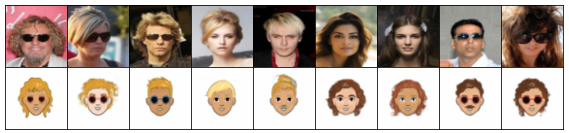

# Multi-view hierarchical Variational AutoEncoders with Factor Analysis latent space
by
Alejandro Guerrero-López,
Carlos Sevilla-Salcedo,
Vanessa Gómez-Verdejo
and Pablo M. Olmos

This paper has been submitted for publication and the [preprint](https://arxiv.org/abs/2207.09185) is already available.

We propose a novel method to disentangle private-shared information between heterogeneous views of the same observation. To do so, we propose a factor analysis framework to combine
multiple VAEs structures. In that way, we are capable of:
- Conditioning **single** VAEs to binary or multilabel targets
 
 
    *Feasibility test: vanilla VAE vs vanilla VAE with FA-VAE approach* 
- Combining **multiple** VAEs to learn and **disentangle private-shared**
information from different m-views

    *Analysis of private information over CelebA and Cartoon datasets*

    *Analysis of shared information over CelebA and Cartoon datasets*

    *Analysis of private-shared information over CelebA and Cartoon datasets*

- Performing **domain adaptation** given different representations of the
same data by using multiple VAEs:
    
    

    *Domain adaptation performed by FA-VAE Model*

    

    *Domain adaptation performed by Multi-VAE SOTA model*

- Performing **transfer learning** between multiple VAEs

    *Transfer learning approach: $\beta$-VAE trained by its own vs Transfer learning to $\beta$-VAE with FA-VAE approach*

## Abstract

> Nowadays, real-world databases come in heterogeneous and multiple representations. 
> Therefore, exploiting and disentangling private-shared information between views is an important goal. 
> However, current studies often fuse every representation in a non-linear way where we lose the information understanding. 
> We propose a novel Factor Analysis method based on multiple Variational AutoEncoder architectures (FA-VAE). 
> Concretely, we learn every private representation of a heterogeneous view in a continuous latent space learned by a VAE. 
> Then, we model the shared latent space by projecting every private variable, given by each VAE, to a low-dimensional factor analysis 
> latent space using a linear projection matrix and a zero-mean Gaussian noise. By modifying the prior over each VAE's continuous latent space 
> we connect both private and shared latent variables. Therefore, we propose a unique model that is able, at the same time, to: 
> (i) condition multiple VAEs to binary or multilabel classification tasks, 
> (ii) learn and disentangle the private-shared information from different $m$-views, 
> (iii) perform domain adaptation given different representations of the same data, and, 
> (iv) perform transfer learning between multiple VAEs.

## Software implementation

All source code used to generate the results and figures in the paper are in
the following folders:
- `condition_a_VAE`: contains the code about the first experiment in the paper.
- `domain_adaptation`: contains the code about the second experiment in the paper.
- `transfer_learning`: contains the code about the third experiment in the paper.
  
The data used in this study is publicly available. You should create a folder called `datasets` 
and download there CelebA and Cartoon datasets. Due to their size, we do not upload them to
this repo.

## Get the repo!

You can clone this 
[git](https://git-scm.com/) repository by running:

    git clone https://github.com/aguerrerolopez/FA-VAE

## Dependencies

You'll need a working Python environment to run the code.
The recommended way is by using
[Anaconda Python distribution](https://www.anaconda.com/download/).
The required dependencies are specified in the file `environment.yml`.

We use `conda` virtual environments to manage the project dependencies in
isolation. Hence, you can install our dependencies without causing conflicts with your
setup.

Run the following command in the repository folder (where `environment.yml`
is located) to create a separate environment and install all required
dependencies in it:

    conda env create -f environment.yml
    conda activate vaesshiba

